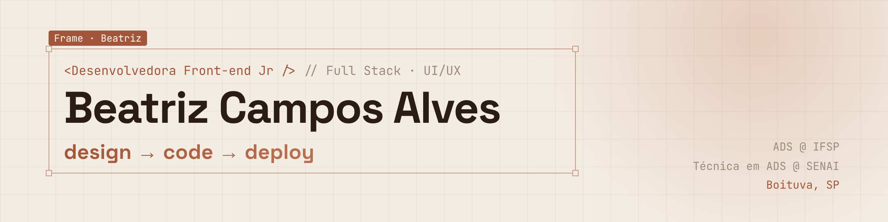

  

  
  
  

 

<table>
<tr>
<td width="56%" valign="top">

### 👩‍💻 Quem sou eu

Sou **desenvolvedora Full Stack** que se sente em casa no **front-end**: gosto de trabalhar exatamente onde o código encontra as pessoas.

Antes de escrever uma linha, eu abro o **Figma**: entendo quem vai usar, desenho o fluxo e prototipo. Só depois levo para **React, Next.js ou Angular** com **TypeScript**, e no back-end uso **Java** e **Node.js**.

</td>
<td width="44%" valign="top">

### ⚡ Em resumo

🎓 **ADS** no IFSP · 2025–2027 
🛠️ **Técnica em ADS** · SENAI "Ítalo Bologna" 
🎨 Cursando **Google UX Design** 
💼 Já fiz sites para clientes como **freelancer** 
📍 Boituva, SP · 🌎 inglês intermediário 
🔍 Aberta a vagas **júnior** remotas ou em Sorocaba

</td>
</tr>
</table>

## 🎨 Meu jeito de trabalhar

  

  
  →
  
  →
  
  →
  

## 🧰 Minha caixa de ferramentas

    
  

## 🚀 Projetos

<table>
<tr>
<td width="50%" valign="top">

#### 🌐 [Portfólio](https://github.com/beatrizcampos-dev/portfolio)
Meu site pessoal, com identidade visual própria: a capa imita um frame selecionado no Figma.

`Next.js` `TypeScript` `Tailwind`

✅ **No GitHub**

</td>
<td width="50%" valign="top">

#### 📅 Agenda Fácil
App de agendamento para pequenos negócios. Começa como **case de UX** no Figma e vira produto **full stack**.

`Figma` `Next.js` `Spring Boot` `PostgreSQL`

🚧 **Em construção**

</td>
</tr>
<tr>
<td width="50%" valign="top">

#### 🛒 Loja Angular
E-commerce com catálogo, carrinho e componentes reutilizáveis.

`Angular` `TypeScript`

🚧 **Em reforma**

</td>
<td width="50%" valign="top">

#### ✈️ Pacotes de Viagem
Loja online em Java aplicando orientação a objetos: carrinho, checkout simulado e área admin.

`Java` `POO`

🚧 **Em andamento**

</td>
</tr>
</table>

<b>🎓 Formação e cursos</b> (clique para abrir)

 

| Quando | O quê | Onde |
|---|---|---|
| 2025 – 2027 | Tecnologia em Análise e Desenvolvimento de Sistemas | IFSP |
| 2023 – 2024 | Técnico em Análise e Desenvolvimento de Sistemas (integrado ao Ensino Médio) | SENAI "Ítalo Bologna" · Itu/SP |
| 2026 | Google UX Design *(em andamento)* | Google · Coursera |

<b>🌱 O que estou fazendo agora</b> (clique para abrir)

 

- 📚 Estudando **UX Design** pelo certificado do Google
- 🏗️ Construindo o **Agenda Fácil**, do protótipo ao deploy
- 🧩 Reformando projetos da faculdade para virarem portfólio de verdade
- 🔍 Buscando minha **primeira vaga** como desenvolvedora júnior

## 📊 Meus números

  
  

  

  

## 🐍 A cobrinha passando pelas minhas contribuições

  <picture>
    <source media="(prefers-color-scheme: dark)" srcset="https://raw.githubusercontent.com/beatrizcampos-dev/beatrizcampos-dev/output/snake-escuro.svg" />
    
  </picture>

  <b>Tem uma vaga, um projeto ou só quer trocar uma ideia?</b> 
  <a href="https://www.linkedin.com/in/beatrizcampos-dev">Me chama no LinkedIn</a> · <a href="mailto:beatrizcalves2024@gmail.com">beatrizcalves2024@gmail.com</a>

